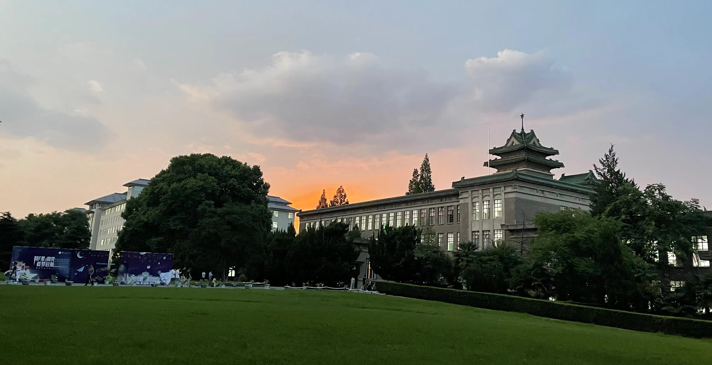

 

 

<h2>About Me</h2>

    I am a teaching assistant at the HKBU in the Department of <a href="https://bus.hkbu.edu.hk/eng/bus/department/aef/heads-message/index.jsp">AEF</a>, where I work in assisting the <a href="https://mscdabe.hkbu.edu.hk/eng/main/Index">DABE</a> master program. I am currently seeking a PhD position in Agri Econ/Management. In my research, I use computational methods to study agricultural finance,crowdfunding entrepreneurship and resident healthcare. I am also interested in how ICTs and STSs can help people form online trust and enhance well-being, with a focus on vulnerable and marginalized populations,like the elder,famres in the developing countries.

    I earned my MS degree in Information Systems from <a href="https://www.cb.cityu.edu.hk/is/">City University of Hong Kong</a> in October 2023. I have a bachelor's degree in Agricultural Economics and Management from <a href="https://www.njau.edu.cn/mainm.htm">Nanjing Agricultural University</a> and have worked as a research intern at places like Core Biotech. I have been recognized as an "Outstanding Graduate" at Nanjing Agri Univ.

    My past work has examined how people form their <a href="resources/MS_Onlinetrust.pdf">online trust</a> in crowdfunding communities,<a href="resources/MS_IS6912.pdf">the antecedents and discrimination</a> in crowdfunding,as well as <a href="https://zjzhang1999.github.io/cfmp.github.io/">the interpretable multimodality reasoning model</a> for crowdfunding success prediction. In my UG <a href="resources/UG_Dissertation.pdf">disseration</a>, I explored the risk preference in rural households entrepreneurship. I was also independently responsible for a field investigation of futures insurance in my sophomore year and drafted a simple <a href="resources/UG_Future insurance.pdf">investigation report.

<h2>News</h2>

<table style="width:100%">
    <tr>
        <td width="15%">Oct 2023</td>
        <td>I graduated from CityU!</td>
    </tr>
    <tr>
        <td width="15%">Aug 2023</td>
        <td>I 'll be serving as the FT-TA at HKBU. </td>
    </tr>
    <tr>
        <td width="15%">June 2022</td>
        <td>I graduated from Nanjing Agri Univ!</td>
    </tr>
</table>

 

<h2 id="teaching-and-resources">Working, learning, and resources</h2>

I assist serveral courses in <a href="https://mscdabe.hkbu.edu.hk/eng/programme/curriculum/index.jsp">MSc of Data Analytics and Business Economics </a> program in 2023 Aug-2024 July:

<ul>
  <li>ECON4006 Time Series Analysis and Forecasting</li>
  <li>ECON7880 Foundations in Big Data Analytics: Concepts and Techniques</li>
  <li>ECON7920 Executive Workshop Series</li>
  <li>ECON7035 Artificial Intelligence for Business</li>
  <li>ECON7940 Data-driven Decision Making</li>
  
</ul>

I’m a builder for a large multimodal crowdfunding dataset and maintainer for the CLES database:

<ul>
  <li><a href="https://github.com/zjzhang1999/Kick60K">Kick60 (collected from Kickstarter)</a></li>
  <li> <a href="http://jscv.njau.edu.cn/#/data/visualization"> CLES(2020~)</a></li>
</ul>

 

<!--
## About Me

I am a teaching assistant at the HKBU on the department of AEF, where I work in assisting the <a href="https://mscdabe.hkbu.edu.hk/eng/main/Index">DABE</a> master program. I am currently seeking the PhD position in information science/computuer science. In my research, I use computational methods to study online trust,data breaches and platform security. I am also interested sociolinguistic ideas,in other	words,how	to facilitate our	expression and thus animate	online communities.

I earned my MS degree in Infomation Systems from <a href="https://www.cb.cityu.edu.hk/is/">City University of Hong Kong</a> on Oct,2023. I have a bachlor's degree in Economics from the Nanjing Agricultural University and have worked as a research intern at places like Core Biotech. I 've been recognized as a "Outstanding Graduates" in Nanjing Agri Univ.

My past work has examined how people in crowdfunding communities form their online trust,how to mitigate data breaches in healthcare systems,and the interpretable	multimodality reasoning algorithm. 

<h2 id="news">News</h2>

<table style="width:100%">
  <tr>
    <td width="15%">May 2024</td>
    <td>Invited to give a keynote talk at the Workshop on Reference, Framing, and Perspective at LREC-COLING 2024 in Torino</td>
  </tr>
  <tr>
    <td width="15%">Nov 2023</td>
    <td>New preprint about <a href="https://arxiv.org/abs/2312.11803">guiding principles for NLP for healthcare</a> using maternal health as a case study</td>
  </tr>
  <tr>
    <td width="15%">Dec 2023</td>
    <td>Invited to give a keynote talk at NLP4DH in Tokyo</td>
  </tr>
  <tr>
</table>

## Publications

1. F.Bar, J.Doe: Effects of having a placeholder of a name
2. S.Holmes, J.Watson: Consequences of living with a sociopath in London

## Typography

This is a [link](http://google.com). Something *italics* and something **bold**.

Here is a table

Year | Award | Category
-----|-------|--------
2014 | Emmy  | Won Outstanding Lead Actor in a miniseries or a movie
2015 | BAFTA | Nominated for Best Leading Actor for Sherlock
2014 | Satellite | Won Best Actor miniseries or television film

Here is a horizontal rule

---

Here is a blockquote

> To a great mind, nothing is little
-->

